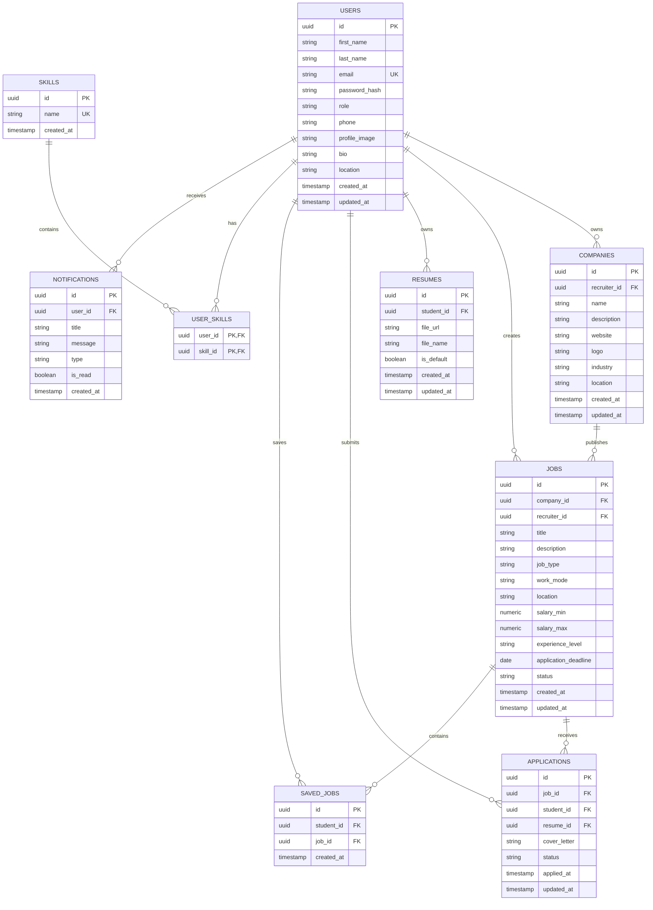

# SkillBridge Database Documentation

## 1. Database Overview
SkillBridge uses a normalized, relational **PostgreSQL** database designed for high performance, scalability, and strict data integrity. Primary keys across all tables are generated dynamically as **UUID v4** strings using PostgreSQL's native `pgcrypto` extension (`gen_random_uuid()`).

- **Database Name**: `skillbridge`
- **Primary Key Strategy**: UUID v4 (`gen_random_uuid()`)
- **Key Features**: Auto-updating `updated_at` timestamps via triggers, explicit cascading delete rules, comprehensive indexes, and strict field check constraints.

---

## 2. Entity Relationship (ER) Diagram



---

## 3. Tables & Schema Definitions

### 1. `users`
Main identity table for all platform users (students, recruiters, admins).
- `id` (UUID, Primary Key, Default: `gen_random_uuid()`)
- `first_name` (VARCHAR(100), NOT NULL)
- `last_name` (VARCHAR(100), NOT NULL)
- `email` (VARCHAR(255), NOT NULL, UNIQUE)
- `password_hash` (TEXT, NOT NULL)
- `role` (VARCHAR(20), NOT NULL, CHECK: `student`, `recruiter`, `admin`)
- `phone` (VARCHAR(30), NULLABLE)
- `profile_image` (TEXT, NULLABLE)
- `bio` (TEXT, NULLABLE)
- `location` (VARCHAR(255), NULLABLE)
- `created_at` (TIMESTAMPTZ, Default: `CURRENT_TIMESTAMP`)
- `updated_at` (TIMESTAMPTZ, Default: `CURRENT_TIMESTAMP`)

### 2. `companies`
Company profile data managed by recruiters.
- `id` (UUID, Primary Key, Default: `gen_random_uuid()`)
- `recruiter_id` (UUID, NOT NULL, Foreign Key -> `users(id)`)
- `name` (VARCHAR(255), NOT NULL)
- `description` (TEXT, NULLABLE)
- `website` (TEXT, NULLABLE)
- `logo` (TEXT, NULLABLE)
- `industry` (VARCHAR(150), NULLABLE)
- `location` (VARCHAR(255), NULLABLE)
- `created_at` (TIMESTAMPTZ, Default: `CURRENT_TIMESTAMP`)
- `updated_at` (TIMESTAMPTZ, Default: `CURRENT_TIMESTAMP`)

### 3. `skills`
Master list of standardized technical and professional skills.
- `id` (UUID, Primary Key, Default: `gen_random_uuid()`)
- `name` (VARCHAR(100), NOT NULL, UNIQUE)
- `created_at` (TIMESTAMPTZ, Default: `CURRENT_TIMESTAMP`)

### 4. `jobs`
Job postings created by recruiters for companies.
- `id` (UUID, Primary Key, Default: `gen_random_uuid()`)
- `company_id` (UUID, NOT NULL, Foreign Key -> `companies(id)`)
- `recruiter_id` (UUID, NOT NULL, Foreign Key -> `users(id)`)
- `title` (VARCHAR(255), NOT NULL)
- `description` (TEXT, NOT NULL)
- `job_type` (VARCHAR(50), NOT NULL, CHECK: `FULL_TIME`, `PART_TIME`, `INTERNSHIP`, `CONTRACT`, `FREELANCE`)
- `work_mode` (VARCHAR(50), NOT NULL, CHECK: `REMOTE`, `HYBRID`, `ONSITE`)
- `location` (VARCHAR(255), NULLABLE)
- `salary_min` (NUMERIC(12,2), NULLABLE, CHECK: `>= 0`)
- `salary_max` (NUMERIC(12,2), NULLABLE, CHECK: `>= 0`)
- `experience_level` (VARCHAR(100), NULLABLE)
- `application_deadline` (DATE, NULLABLE)
- `status` (VARCHAR(30), NOT NULL, Default: `'ACTIVE'`, CHECK: `ACTIVE`, `CLOSED`, `DRAFT`)
- `created_at` (TIMESTAMPTZ, Default: `CURRENT_TIMESTAMP`)
- `updated_at` (TIMESTAMPTZ, Default: `CURRENT_TIMESTAMP`)
- *Salary Range Constraint*: `salary_min IS NULL OR salary_max IS NULL OR salary_max >= salary_min`

### 5. `resumes`
Metadata references for uploaded student resumes.
- `id` (UUID, Primary Key, Default: `gen_random_uuid()`)
- `student_id` (UUID, NOT NULL, Foreign Key -> `users(id)`)
- `file_url` (TEXT, NOT NULL)
- `file_name` (VARCHAR(255), NOT NULL)
- `is_default` (BOOLEAN, Default: `FALSE`)
- `created_at` (TIMESTAMPTZ, Default: `CURRENT_TIMESTAMP`)
- `updated_at` (TIMESTAMPTZ, Default: `CURRENT_TIMESTAMP`)

### 6. `applications`
Job applications submitted by students.
- `id` (UUID, Primary Key, Default: `gen_random_uuid()`)
- `job_id` (UUID, NOT NULL, Foreign Key -> `jobs(id)`)
- `student_id` (UUID, NOT NULL, Foreign Key -> `users(id)`)
- `resume_id` (UUID, NULLABLE, Foreign Key -> `resumes(id)`)
- `cover_letter` (TEXT, NULLABLE)
- `status` (VARCHAR(30), NOT NULL, Default: `'APPLIED'`, CHECK: `APPLIED`, `REVIEWING`, `SHORTLISTED`, `INTERVIEW`, `SELECTED`, `REJECTED`, `WITHDRAWN`)
- `applied_at` (TIMESTAMPTZ, Default: `CURRENT_TIMESTAMP`)
- `updated_at` (TIMESTAMPTZ, Default: `CURRENT_TIMESTAMP`)
- *Unique Constraint*: `UNIQUE(job_id, student_id)` (prevents duplicate applications per job)

### 7. `saved_jobs`
Bookmarks created by students for job listings.
- `id` (UUID, Primary Key, Default: `gen_random_uuid()`)
- `student_id` (UUID, NOT NULL, Foreign Key -> `users(id)`)
- `job_id` (UUID, NOT NULL, Foreign Key -> `jobs(id)`)
- `created_at` (TIMESTAMPTZ, Default: `CURRENT_TIMESTAMP`)
- *Unique Constraint*: `UNIQUE(student_id, job_id)`

### 8. `user_skills`
Junction table mapping users to skills (many-to-many).
- `user_id` (UUID, NOT NULL, Foreign Key -> `users(id)`)
- `skill_id` (UUID, NOT NULL, Foreign Key -> `skills(id)`)
- `PRIMARY KEY (user_id, skill_id)`

### 9. `notifications`
In-app user notifications.
- `id` (UUID, Primary Key, Default: `gen_random_uuid()`)
- `user_id` (UUID, NOT NULL, Foreign Key -> `users(id)`)
- `title` (VARCHAR(255), NOT NULL)
- `message` (TEXT, NOT NULL)
- `type` (VARCHAR(50), NULLABLE)
- `is_read` (BOOLEAN, Default: `FALSE`)
- `created_at` (TIMESTAMPTZ, Default: `CURRENT_TIMESTAMP`)

---

## 4. Delete Behavior (ON DELETE Strategies)

| Foreign Key Relationship | Strategy | Justification |
| :--- | :--- | :--- |
| `users` -> `resumes` | `ON DELETE CASCADE` | Student resumes belong directly to user profile; deleting student deletes resumes. |
| `users` -> `saved_jobs` | `ON DELETE CASCADE` | Saved job bookmarks are personal user data. |
| `users` -> `user_skills` | `ON DELETE CASCADE` | User skill links are personal profile data. |
| `users` -> `notifications` | `ON DELETE CASCADE` | Notifications belong strictly to the receiving user. |
| `users` -> `applications` | `ON DELETE CASCADE` | Applications submitted by a deleted student are purged. |
| `jobs` -> `applications` | `ON DELETE CASCADE` | Deleting a job removes associated job application submissions. |
| `jobs` -> `saved_jobs` | `ON DELETE CASCADE` | Deleting a job removes all student bookmarks for it. |
| `skills` -> `user_skills` | `ON DELETE CASCADE` | Deleting a skill cleans up junction references. |
| `companies` -> `jobs` | `ON DELETE CASCADE` | Deleting a company removes all published job postings. |
| `users` -> `companies` | `ON DELETE RESTRICT` | Prevents deleting recruiter accounts if active company profiles exist, preserving organizational data. |
| `users` -> `jobs` (recruiter) | `ON DELETE RESTRICT` | Prevents accidental deletion of recruiters who own active job postings. |
| `resumes` -> `applications` | `ON DELETE SET NULL` | Deleting a resume preserves the historical application submission with `resume_id` set to `NULL`. |

---

## 5. Indexes Strategy

1. **`users`**:
   - `idx_users_role` on `role` (for role-filtered queries).
2. **`companies`**:
   - `idx_companies_recruiter_id` on `recruiter_id`.
3. **`jobs`**:
   - `idx_jobs_company_id`, `idx_jobs_recruiter_id`
   - `idx_jobs_status`, `idx_jobs_location`, `idx_jobs_work_mode`, `idx_jobs_job_type`, `idx_jobs_application_deadline`, `idx_jobs_created_at`
   - `idx_jobs_title`, `idx_jobs_experience_level`, `idx_jobs_search_filter` (Prepares for fast job search filtering).
4. **`applications`**:
   - `idx_applications_job_id`, `idx_applications_student_id`, `idx_applications_status`, `idx_applications_applied_at`.
5. **`saved_jobs`**:
   - `idx_saved_jobs_student_id`, `idx_saved_jobs_job_id`.
6. **`resumes`**:
   - `idx_resumes_student_id`.
7. **`notifications`**:
   - `idx_notifications_user_id`, `idx_notifications_is_read`, `idx_notifications_created_at`.

---

## 6. Seed Data Summary
The initial development seed contains:
- **Users**: 1 Admin (`admin@skillbridge.dev`), 2 Recruiters, 3 Students.
- **Companies**: 3 Companies (`TechCorp Innovations`, `CloudScale Solutions`, `DataNexus Inc.`).
- **Skills**: 16 standard development skills (React, Node.js, TypeScript, PostgreSQL, Docker, AWS, etc.).
- **Jobs**: 11 realistic job postings with diverse types (FULL_TIME, CONTRACT, INTERNSHIP), work modes (REMOTE, HYBRID, ONSITE), and statuses (ACTIVE, DRAFT, CLOSED).
- **Resumes**: 3 Student resumes with metadata links.
- **Applications**: 4 job applications tracking various status stages (SHORTLISTED, REVIEWING, INTERVIEW, APPLIED).
- **Saved Jobs**: 3 Saved job bookmarks.
- **User Skills**: Skill mappings for student profiles.
- **Notifications**: System notifications for applicants and recruiters.

---

## 7. Migration & Seeding Instructions

### Commands
In `backend/`:

```bash
# Run Database Schema Migration
npm run db:migrate

# Run Seed Data Population
npm run db:seed

# Run Both Migration and Seed
npm run db:setup
```

### Manual PostgreSQL Verification
Connect to PostgreSQL using `psql`:

```bash
psql -U postgres -d skillbridge
```

Inspect database:
```sql
\dt              -- List all tables
\d users         -- View table definition and constraints
SELECT * FROM users;
SELECT * FROM jobs;
```
